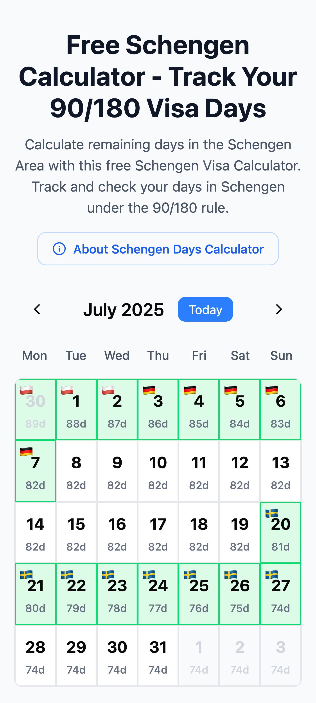
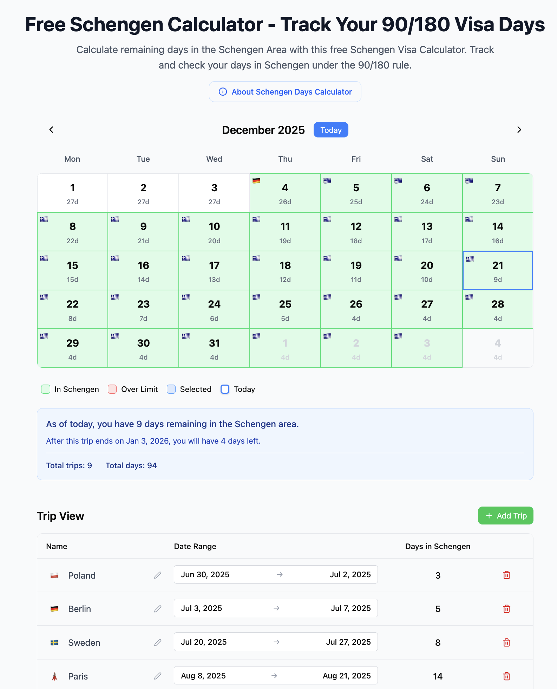

# Schengen Calculator

[View Live Schengen Visa Calculator Demo](https://schengen.patrick.is)

A web application to help travellers track their time spent in the Schengen Area and ensure compliance with the Schengen 90/180 rule in Europe. Written with 20+ years of development experience, guiding an AI tool (because leaving AI to do its thing alone will give you garbage).

| Mobile | Desktop |
|--------|---------|
|  | 

## Overview

The Schengen Area allows visa-free travel for many, but with an important restriction: you can only spend **90 days within any 180-day period** in the Schengen zone. This calculator helps you:

- Track all your trips to the Schengen Area
- See how many days you have remaining at any given time
- Visualize your trips on an interactive calendar
- Ensure you don't exceed the 90-day limit

## Features

- **Interactive Calendar View**: See your remaining days for each date in the month
- **Trip Management**: Add, edit, and delete trips with an intuitive interface
- **Visual Indicators**:
  - Green highlighting for days you're in the Schengen Area
  - Red highlighting when you've exceeded the 90-day limit
  - Day-by-day remaining days counter
- **Date Range Picker**: Easily select trip dates with a two-click interface
- **Trip Dialog**: Click on calendar dates to view and edit existing trips
- **Status Summary**: See your current status, total trips, and total days
- **About Section**: Comprehensive information about the Schengen 90/180 rule, visa requirements, and how to use the calculator
- **SEO Optimized**: Optimized for search engines to help travelers find this free tool
- **Mobile Responsive**: Optimized layout for both desktop and mobile devices
- **Local Storage**: Your trip data is saved automatically in your browser

## Technology Stack

- **React 19** - UI framework
- **Vite** - Build tool and dev server
- **Tailwind CSS 4** - Styling
- **shadcn/ui** - UI components

## Getting Started

### Prerequisites

- Node.js 18+ and npm

### Installation

```bash
# Clone the repository
git clone <repository-url>

# Navigate to the project directory
cd schengen-calculator

# Install dependencies
npm install

# Start the development server
npm run dev
```

The app will be available at `http://localhost:5173`

### Building for Production

```bash
npm run build
```

The production build will be in the `dist` directory.

## How to Use

1. **Add a Trip**: Click the "+ Add Trip" button and enter your trip details
2. **Select Dates**: Click on two dates in the calendar to create a trip, or use the date range picker
3. **Edit Trips**: Click on a date with an existing trip to open the trip editor dialog
4. **View Status**: Check the status panel to see your remaining days and when restrictions reset

## Understanding the 90/180 Rule

The Schengen 90/180 rule means:
- You can stay up to 90 days within any 180-day period
- The 180-day period is a rolling window, not a fixed period
- Days are counted from the first day of entry to the last day of exit (inclusive)
- Both the entry and exit days count as days in the Schengen Area

## Development

```bash
# Run development server
npm run dev

# Run type checking
npm run build

# Preview production build
npm run preview
```

## License

This project is open source and available under the MIT License.